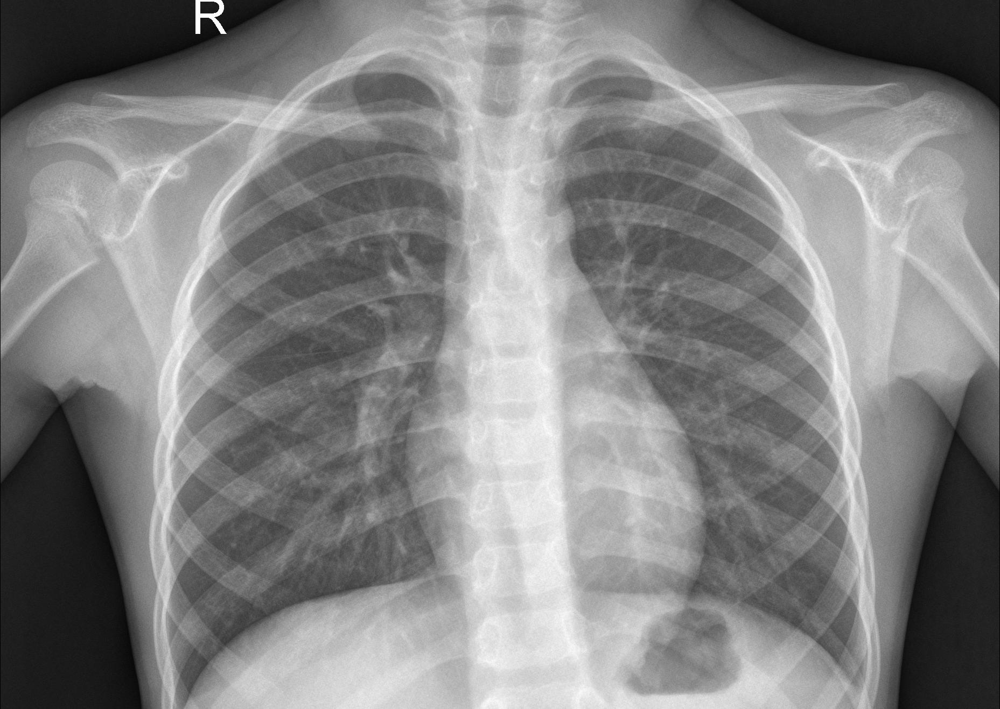
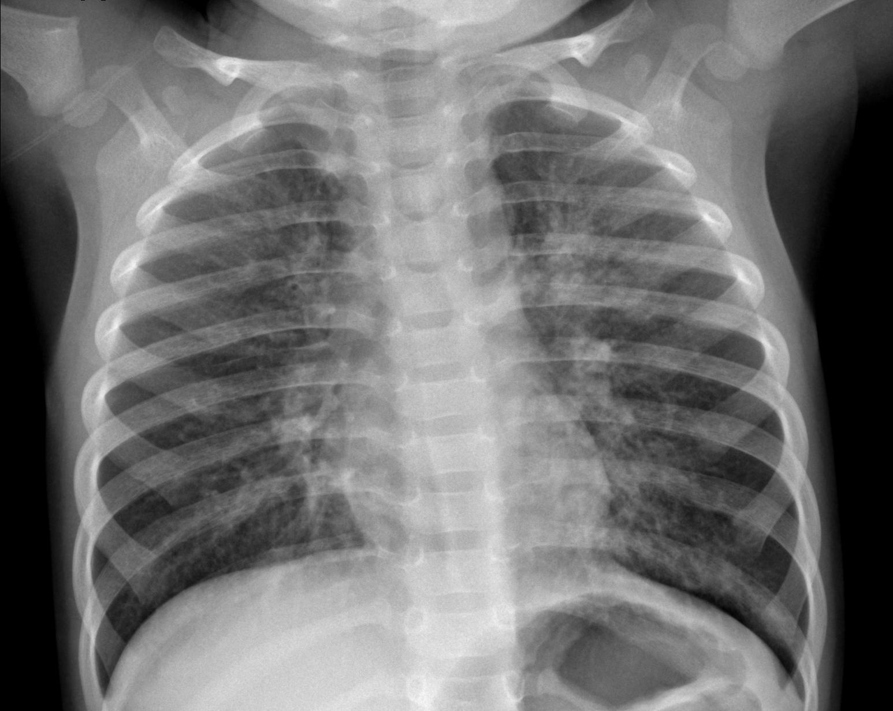
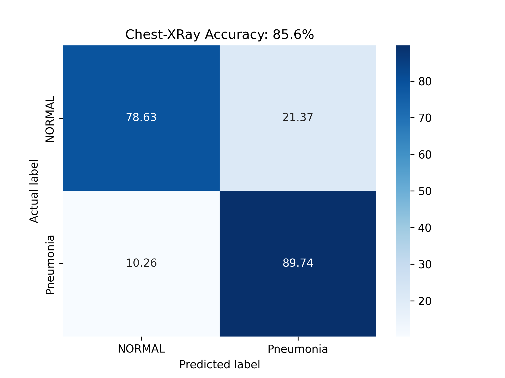

# Chest-X-Ray-Pneumonia-Detection-using-PyTorch-Lightning

This project implements a Convolutional Neural Network (CNN) to detect pneumonia from chest X-ray images, utilizing PyTorch Lightning for streamlined training and evaluation.

## Dataset

The model is trained on the [Chest X-Ray Images (Pneumonia) dataset](https://www.kaggle.com/datasets/paultimothymooney/chest-xray-pneumonia/data), which includes 5,863 images categorized as 'Pneumonia' or 'Normal'. This dataset is organized into training, validation, and test sets, facilitating effective model development and assessment.

### Sample Images

| **Normal**  | **Pneumonia** |
|-------------|--------------|
|  |  |

## Model Architecture

The project employs a CNN architecture built with PyTorch Lightning, enhancing code readability and scalability. PyTorch Lightning abstracts much of the boilerplate code, allowing for a focus on model development and experimentation.

## Training and Evaluation

The model undergoes training with the following configurations:

- **Optimizer:** Adam
- **Loss Function:** Cross-Entropy Loss
- **Metrics:** Accuracy, Precision, Recall

Training is conducted over multiple epochs with data augmentation techniques applied to improve generalization. The model's performance is evaluated on the test set, achieving high accuracy in distinguishing between pneumonia and normal cases.

## Results

The trained model demonstrates robust performance in detecting pneumonia from chest X-ray images. Below is the confusion matrix illustrating the classification results:

